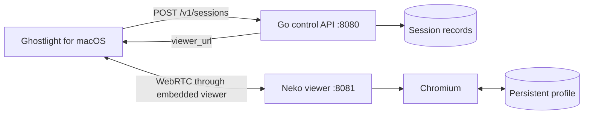

# Ghostlight

Ghostlight runs a persistent Chromium profile on Linux and streams the browser to a native macOS client over WebRTC.

## Daily-driver milestone

The next milestone has one acceptance path:

1. Run flag-free `docker compose up` from the repository root on the Linux host.
2. Launch `Ghostlight.app` on the Mac.
3. Open Gmail and find the existing signed-in session.
4. Close Ghostlight.
5. Reopen Ghostlight and find the same Gmail session and tabs.

The acceptance gate is seven consecutive days with one successful close-and-reopen check and one successful Compose-restart check each day. Dex control lease work starts after that gate passes.

Today, the repository provides flag-free Compose startup and a script that builds an ad-hoc signed `Ghostlight.app` for local testing. Notarized distribution and repeated Gmail persistence testing remain acceptance work.

## What works

| Surface | Current behavior |
| --- | --- |
| Linux browser | Neko runs Chromium from a digest-pinned multi-architecture container image. |
| Browser persistence | Chromium writes its profile to `runtime/data/chromium` on the Linux host. |
| Control API | A Go service creates, reads, and deletes session records in `runtime/data/control/sessions.json`. |
| macOS client | A native SwiftUI executable creates a session record and opens the returned Neko viewer URL in `WKWebView`. |
| Connection | Neko negotiates browser video, audio, and input over WebRTC. |
| Validation | Preflight checks configuration; smoke tests check control health, session creation, and viewer reachability. |

The control API records session metadata. It does not create or stop the Neko container; Docker Compose owns both services in this alpha.

## Requirements

### Linux host

- Docker Engine
- Docker Compose v2
- `curl`
- `openssl`
- a persistent filesystem for `runtime/data/`

### Mac

- macOS 14 or later
- Swift 5.10 or later for the development executable
- network access to the Linux control, viewer, and WebRTC ports

### Development and verification

- Go 1.24
- ShellCheck
- the Linux and Mac requirements for their respective module checks

The Linux host and Mac should start on the same trusted LAN. The alpha exposes unauthenticated HTTP control endpoints and has no TLS termination.

## Start the Linux runtime

Run these commands from the repository root on the Linux host:

```sh
cp runtime/.env.example runtime/.env
```

Generate separate viewer passwords:

```sh
openssl rand -hex 32
openssl rand -hex 32
```

Edit `runtime/.env` and set at least these values:

```dotenv
GHOSTLIGHT_VIEWER_URL=http://192.168.1.20:8081
NEKO_USER_PASSWORD=<first-generated-password>
NEKO_ADMIN_PASSWORD=<second-generated-password>
NEKO_WEBRTC_NAT1TO1=192.168.1.20
```

Replace `192.168.1.20` with the Linux address reachable from the Mac. Keep `GHOSTLIGHT_VIEWER_URL` and `NEKO_WEBRTC_NAT1TO1` on the same reachable host unless the network has an explicit proxy or NAT arrangement.

Validate and start the stack from the repository root:

```sh
runtime/bin/preflight.sh
docker compose up --build -d
runtime/bin/smoke.sh
```

Inspect service state and logs:

```sh
docker compose --env-file runtime/.env -f runtime/docker-compose.yml ps
docker compose --env-file runtime/.env -f runtime/docker-compose.yml logs --tail=100 viewer control
```

Stop the containers without deleting the browser profile:

```sh
docker compose --env-file runtime/.env -f runtime/docker-compose.yml down
```

`runtime/.env` and `runtime/data/` are excluded from Git. Back up `runtime/data/chromium` as credential-bearing browser data.

## Launch the macOS client

Build the local test application:

```sh
macos/package-app.sh
open macos/.build/Ghostlight.app
```

The bundle is ad-hoc signed with the stable identifier `org.evalops.Ghostlight`. It is intended for local development and is not notarized for distribution.

Enter the Linux control URL, such as `http://192.168.1.20:8080`, and select **Connect**. The app saves a successful URL and reconnects to it on later launches. It sends `POST /v1/sessions`, receives the configured viewer URL, and loads the Neko login screen.

Sign in with `NEKO_USER_PASSWORD`. Website sessions, cookies, local storage, and tabs belong to the Chromium profile on the Linux host rather than the Mac app process.

After signing in to Gmail and opening two tabs, run the daily-driver acceptance path at the top of this README. Repeat the path after restarting the Compose stack.

Record any lost login, missing tab, blank viewer, or reconnect failure with the error text shown in Ghostlight, the full `docker compose --env-file runtime/.env -f runtime/docker-compose.yml ps` output, and the last 100 lines from both container logs.

## Architecture



Docker Compose starts `viewer` and `control`. The macOS app talks to the control API once per connection, then the embedded Neko client handles viewer login, signaling, media, and input. Browser traffic goes from Chromium on Linux to the destination website; the Go service does not proxy browser traffic or media.

The LAN threat model is in [docs/architecture.md](docs/architecture.md). Its lifecycle and persistence sections describe a target architecture. This README and the module READMEs describe the shipped alpha behavior.

## Network ports

| Default port | Protocol | Purpose | Required from the Mac |
| ---: | --- | --- | --- |
| `8080` | TCP | Ghostlight control API | Yes |
| `8081` | TCP | Neko viewer and signaling | Yes |
| `52000` | UDP and TCP | Neko WebRTC mux | Yes |

Allow both UDP and TCP on port `52000`. If the viewer page loads but the stream is blank or disconnected, check `NEKO_WEBRTC_NAT1TO1` and port `52000`.

## Control API

Check health:

```sh
curl --fail http://192.168.1.20:8080/healthz
```

Create a session record:

```sh
curl --fail \
  -X POST \
  -H 'Content-Type: application/json' \
  --data '{}' \
  http://192.168.1.20:8080/v1/sessions
```

A successful response has this shape:

```json
{
  "id": "6cbb94b6-d132-45d2-856f-77e820f2aa8d",
  "viewer_url": "http://192.168.1.20:8081",
  "created_at": "2026-08-12T10:00:00Z"
}
```

The API also supports `GET /v1/sessions/{id}` and `DELETE /v1/sessions/{id}`. Deleting a session record does not delete the Chromium profile or stop Neko.

## Verify the repository

Run the module and repository checks from the repository root:

```sh
(cd control && go test ./...)
(cd control && go test -race ./...)
(cd control && go vet ./...)
swift test --package-path macos
runtime/tests/test_runtime.sh
scripts/test-repo-hygiene.sh
scripts/test-check-shell.sh
bash scripts/check-shell.sh
```

The runtime test requires Docker Compose to render the Compose model. CI runs `go test ./...`, repository hygiene, ShellCheck, runtime regression tests, and Compose validation on Linux. It runs `swift test --package-path macos` and builds the local app bundle on macOS.

## Troubleshooting

### Preflight reports install-time placeholders

Open `runtime/.env` and replace each `__GENERATE_AT_INSTALL__` assignment value. Marker text in full-line or inline comments is accepted.

### The Mac cannot reach the control API

Run `curl http://<linux-host>:8080/healthz` from the Mac. Check the Linux firewall and confirm that `docker compose --env-file runtime/.env -f runtime/docker-compose.yml ps` publishes `0.0.0.0:8080->8080/tcp` or the intended private interface.

### The viewer opens but video never connects

Confirm that `NEKO_WEBRTC_NAT1TO1` contains the Linux address reachable from the Mac. Allow `52000/udp` and `52000/tcp` through the host firewall. Check the Neko logs for the advertised ICE candidate and mux address.

### Gmail or tabs disappear after restart

Confirm that `runtime/data/chromium` exists on the Linux host and is mounted at `/home/neko/.config/chromium` inside the viewer container:

```sh
docker inspect \
  "$(docker compose --env-file runtime/.env -f runtime/docker-compose.yml ps -q viewer)" \
  --format '{{json .Mounts}}'
```

Check ownership and free disk space before changing or removing the profile directory.

### Session creation succeeds but returns the wrong viewer host

Update `GHOSTLIGHT_VIEWER_URL` in `runtime/.env`, then recreate the control container:

```sh
docker compose --env-file runtime/.env -f runtime/docker-compose.yml up -d --force-recreate control
```

## Repository layout

| Path | Contents |
| --- | --- |
| `macos/` | SwiftUI client, WebKit viewer, and Swift tests |
| `control/` | Go control API, JSON session store, and Go tests |
| `runtime/` | Compose stack, environment template, preflight, smoke checks, and persistent data paths |
| `docs/` | Architecture and test documentation |
| `scripts/` | Repository hygiene and shell validation |

## Scope

The alpha supports one user, one Neko browser, one Linux host, and one trusted LAN. It has no control authentication, TLS, TURN service, multi-host scheduler, account system, billing, automatic updates, signed macOS package, or public-internet deployment path.

Changes that improve the daily-driver acceptance path belong in the current milestone. Multi-user control, Dex leases, fleet scheduling, and production deployment remain outside it.

## Contributing and license

See [CONTRIBUTING.md](CONTRIBUTING.md) for development expectations and [SECURITY.md](SECURITY.md) for vulnerability reporting. Dependency sources and licenses are recorded in [THIRD_PARTY_NOTICES.md](THIRD_PARTY_NOTICES.md).

Ghostlight is licensed under Apache-2.0. See [LICENSE](LICENSE).
