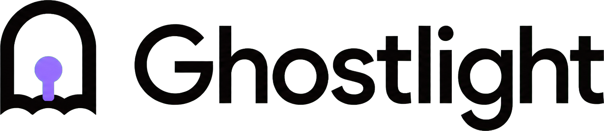

<p align="center">
  <picture>
    <source media="(prefers-color-scheme: dark)" srcset="docs/assets/ghostlight-logo-dark.png">
    <source media="(prefers-color-scheme: light)" srcset="docs/assets/ghostlight-logo.png">
    
  </picture>
</p>

Ghostlight runs a persistent Chromium profile on Linux and streams the browser to a native macOS client over WebRTC.

The [daily-driver readiness ledger](docs/readiness/README.md) separates proven historical evidence from failed or missing tests without collecting browsing content. It uses bounded receipts; calendar duration is not an acceptance gate.

The optional [Chrome continuity companion](docs/chrome-sync.md) sends a chosen tab or window to Ghostlight and can mirror bookmarks or Reading List with separate runtime consent. Credentials, cookies, history, and the Chrome profile stay local.

## Current scope

Ghostlight supports one fixed Chromium profile, one Neko viewer, one macOS client, and a trusted private network. Docker Compose owns service startup, restart, and shutdown. The Go control service keeps a durable workspace, browser-session catalog, tab snapshots, controller leases, command queue, stream descriptors, and attachment metadata. A Chromium extension reports tab state and applies bounded navigation and tab commands through an authenticated native-messaging bridge. Neko carries browser media and input while the native macOS shell presents tabs, navigation, files, controller ownership, and stream readiness directly.

## Daily-driver milestone

The acceptance path is:

1. Run flag-free `docker compose up` from the repository root on the Linux host.
2. Launch `Ghostlight.app` on the Mac.
3. Open Gmail and find the existing signed-in session.
4. Close Ghostlight.
5. Reopen Ghostlight and find the same Gmail session and tabs.

The repository has a Linux persistence receipt and synthetic acceptance tooling. That receipt does not satisfy the native Mac or Gmail checks.

## Requirements

Linux runtime:

- Docker Engine and Docker Compose 2.20 or later
- `curl`, `awk`, and `openssl`
- a persistent filesystem for `runtime/data/chromium`
- a host address reachable from the Mac

macOS client:

- macOS 14 or later
- Swift 5.10 or later for local builds
- access to the Linux control, viewer, and WebRTC ports

Repository verification uses a Go 1.26-compatible module, a Go 1.26.5 container builder, and ShellCheck.

Live browser acceptance requires Node.js with npm, Python 3, `shasum`, and Tesseract OCR. The reviewed container-update commands require Docker Buildx, `jq`, and Perl.

## Download the macOS app

The [GitHub releases page](https://github.com/evalops/ghostlight/releases) provides a universal ZIP for Apple silicon and Intel Macs. Download the ZIP, `BUILD-INFO.txt`, and `SHA256SUMS`, then verify the archive and build receipt in the download directory:

```sh
shasum -a 256 --check SHA256SUMS
```

Extract the ZIP, move `Ghostlight.app` to `/Applications`, and complete the Linux runtime setup below. The alpha package has an ad-hoc code signature and no notarization ticket. For the first launch, Control-click the app, select **Open**, and confirm the prompt if macOS blocks a normal double-click.

Release automation upgrades the package to a Developer ID signature with a notarized, stapled ticket when these repository secrets are configured: `APPLE_CERTIFICATE` (base64-encoded Developer ID Application `.p12`), `APPLE_CERTIFICATE_PASSWORD`, `APPLE_ID`, `APPLE_TEAM_ID`, and `APPLE_APP_SPECIFIC_PASSWORD`. When any of them is missing, the release workflow emits a warning and ships the ad-hoc signed package described above.

## Start the Linux runtime

Run from the repository root on the Linux host:

```sh
cp runtime/.env.example runtime/.env
chmod 600 runtime/.env
openssl rand -hex 32
openssl rand -hex 32
openssl rand -hex 32
openssl rand -hex 32
```

Put different generated values in `NEKO_USER_PASSWORD`, `NEKO_ADMIN_PASSWORD`, `GHOSTLIGHT_API_TOKEN`, and `GHOSTLIGHT_BRIDGE_TOKEN`. For a Mac on the same private network, set these four values to the Linux address reachable from that Mac:

```dotenv
GHOSTLIGHT_BIND_ADDRESS=<linux-host>
GHOSTLIGHT_VIEWER_URL=http://<linux-host>:8081
GHOSTLIGHT_VIEWER_HEALTH_URL=http://viewer:8080
NEKO_WEBRTC_NAT1TO1=<linux-host>
```

Use `127.0.0.1` for a Linux-local stack. `GHOSTLIGHT_BIND_ADDRESS` controls the host interface for the control, viewer, and WebRTC port publications. Preflight accepts literal IPv4 loopback, link-local, or RFC 1918 addresses and IPv6 loopback, link-local, or unique-local addresses. It rejects hostnames, public addresses, and wildcard addresses.

The viewer streams H.264 (constrained baseline, 3072 kbps, zero-latency x264) by default through `NEKO_CAPTURE_VIDEO_CODEC` and `NEKO_CAPTURE_VIDEO_PIPELINE` in `runtime/.env`. Neko forces VP8 when no capture pipeline is configured, so reverting to VP8 takes both changes: `NEKO_CAPTURE_VIDEO_CODEC=vp8` and an empty `NEKO_CAPTURE_VIDEO_PIPELINE`. `NEKO_DESKTOP_SCREEN` defaults to `1920x1080@30`; `1920x1080@60` is a supported knob, and the `framerate=30/1` cap in `NEKO_CAPTURE_VIDEO_PIPELINE` must change to `framerate=60/1` with it. `NEKO_WEBRTC_ICELITE=1` runs Neko's server-side ICE lite agent, which suits the trusted-LAN deployment and stays compatible with the full-ICE WKWebView client.

Validate and start the stack:

```sh
runtime/bin/preflight.sh
docker compose up -d
runtime/bin/smoke.sh
```

Preflight requires mode `600` on `runtime/.env` and mode `700` on the profile. It also rejects leftover install placeholders, a viewer URL host that differs from `NEKO_WEBRTC_NAT1TO1`, an invalid Compose model, a symlink profile path, and a profile that Neko uid `1000` cannot write. The profile write check runs through the digest-pinned Neko image.

The smoke script checks control liveness, Neko `/health`, storage-aware control readiness, legacy viewer discovery, authenticated workspace discovery, bridge bootstrap, and `/health` through the discovered viewer URL.

Inspect or stop the stack with:

```sh
docker compose ps
docker compose logs --tail=100 viewer control
docker compose down
```

`docker compose down` removes the containers and leaves `runtime/data/chromium` on the host.

## Launch the macOS client

```sh
macos/package-app.sh
open macos/.build/Ghostlight.app
```

The script creates an ad-hoc signed bundle at `macos/.build/Ghostlight.app` with identifier `org.evalops.Ghostlight`. The bundle has no Developer ID signature or notarization receipt.

Enter the Linux control URL and `GHOSTLIGHT_API_TOKEN`, then select **Open Ghostlight**. The app resumes or creates the durable browser session, acquires its controller lease when available, and loads the stream URL in `WKWebView`. Sign in to Neko with `NEKO_USER_PASSWORD` when required.

The status row distinguishes `Loading viewer`, `Viewer loaded`, and viewer navigation failure. `Viewer loaded` means WebKit finished the page navigation; it does not confirm a connected WebRTC media stream. Automatic launch from a saved control URL retries failed viewer navigation twice. **Retry** initiates one user-requested reload. **Disconnect** cancels discovery, clears the saved URL, and disables automatic connection on the next launch.

Chromium cookies, local storage, browsing and download history, website sessions, and restored tabs live in the Linux profile. Downloads use a dedicated Docker volume. Control state and staged attachments use separate named volumes. The current macOS app stores only the control URL in `UserDefaults`.

## Network and credentials

| Default port | Protocol | Purpose |
| ---: | --- | --- |
| `8080` | TCP | Control liveness, readiness, and viewer discovery |
| `8081` | TCP | Neko login, viewer page, and signaling |
| `52000` | UDP and TCP | Neko WebRTC media and input mux |

The workspace and session API requires `Authorization: Bearer <GHOSTLIGHT_API_TOKEN>`. Lease-protected writes also require `X-Ghostlight-Lease-Token`; the Chromium bridge uses its separate bearer token. Legacy health, readiness, and `GET /v1/viewer` remain unauthenticated for compatibility. The runtime provides no TLS or rate limiting. Keep the published ports on a trusted private or loopback interface, keep `runtime/.env` free of group and world permissions, and allow both protocols on port `52000` between the Mac and Linux host.

The Chromium profile and its backups contain credential-bearing browser state. `runtime/.env`, `runtime/data/`, screenshots, logs, and diagnostics must remain free of source control and public artifact uploads when they contain credentials or account data.

## Backup and restore

The backup command validates the profile tree, stops the viewer before reading the profile, and leaves it stopped. It refuses operator-controlled symlink path components, nested links and special files, an existing archive or checksum path, and a concurrent backup to the same target. On macOS it permits a root-owned top-level platform alias such as `/var`. It writes a mode-`600` gzip-compressed tar archive plus a mode-`600` `.sha256` sidecar.

```sh
runtime/bin/profile-backup.sh backup \
  runtime/data/chromium \
  /safe/backup/ghostlight-profile.tar.gz
docker compose start viewer
```

Restore verifies the sidecar and permits one archive root containing regular files and directories with unique relative paths. It rejects traversal, links, special files, multiple roots, duplicate entries, symlink path components, and an existing destination. The destination must be an absolute new path.

```sh
runtime/bin/profile-backup.sh restore \
  /safe/backup/ghostlight-profile.tar.gz \
  /safe/restore/chromium
```

Inspect the restored profile before changing `CHROMIUM_PROFILE_DIR` in a reviewed Compose configuration. A restore does not replace `runtime/data/chromium` or start the viewer.

## Verification

```sh
(cd control && go test ./...)
(cd control && go test -race ./...)
(cd control && go vet ./...)
(cd companion/chrome && npm test)
swift test --package-path macos
macos/package-app.sh
runtime/tests/test_runtime.sh
runtime/tests/test_profile_backup.sh
bash scripts/test-repo-hygiene.sh
bash scripts/test-check-shell.sh
bash scripts/check-shell.sh
```

The [2026-08-12 day-one receipt](docs/acceptance/2026-08-12/README.md) records one Linux Compose recreation with changed container IDs, restored synthetic tabs, a persisted synthetic cookie and local-storage value, and before-and-after screenshots. Its test-only Chromium debugging and loopback instrumentation are absent from the runtime Compose file.

### Live Linux persistence lane

```sh
tests/acceptance/run-linux-persistence.sh
```

This command creates a temporary mode-`700` profile, a mode-`600` environment file, and a Compose override. The override adds an AppArmor exception, exposes a loopback-only CDP endpoint, and serves two synthetic pages inside the Neko container. Set `GHOSTLIGHT_ACCEPTANCE_SHARE_VIEWER_NETWORK=1` only on nested hosts that filter sibling-container bridge traffic; the default keeps separate viewer and control network namespaces. The lane runs preflight, builds and starts the stack, creates two Chromium tabs, records their cookie and local-storage marker, tears down and recreates both containers, requires new viewer and control container IDs, and checks both restored tabs and markers. It writes screenshots, JSON evidence, hashes, request logs, and `transcript.txt` under `output/playwright/acceptance/` by default.

The screenshot audit rejects metadata segments plus configured plaintext credential and non-loopback IPv4 marker patterns found in PNG and JPEG bytes and in required Tesseract OCR output. Review each screenshot before publication. Set `GHOSTLIGHT_ACCEPTANCE_KEEP_STACK=1` only when the temporary stack and work directory are needed for debugging.

The [improvement receipt](docs/acceptance/2026-08-12-improvements/README.md) passed at source `f94bb784316e206674234407a75170b10dd0e7bc`. Both services were healthy, both container IDs changed, Chromium restored both synthetic tabs, and the post-recreation server log contained the saved cookie and local-storage marker for each tab. Four inspected screenshots, JSON evidence, request logs, hashes, and the raw transcript are committed with the receipt.

### Native macOS relaunch lane

Build the app, start a synthetic control and viewer endpoint, unlock the Mac, and run:

```sh
GHOSTLIGHT_CONTROL_URL=http://127.0.0.1:8080 \
tools/test-macos-relaunch.sh
```

The first launch receives the URL through its environment. The script waits through macOS Accessibility until the window exposes `Viewer loaded`, captures a screenshot, quits the app, and launches it again without that environment value. It requires `Viewer loaded` again, which exercises saved-URL discovery and WebKit navigation. The screenshots and transcript go to `output/macos-acceptance/` by default and require privacy plus rendering review.

This lane requires Accessibility permission, Screen Recording permission, an unlocked interactive session, and a synthetic endpoint. `Viewer loaded` remains a WebKit navigation assertion; the lane does not inspect decoded WebRTC frames.

The first scripted improvement attempt failed because its terminal runner did not receive the required Accessibility response. A later Computer Use run against the packaged binary reached `Viewer loaded`, exited through Cmd-Q, relaunched the exact bundle without an environment override, and reached `Viewer loaded` again from the saved control URL without another Connect action. The [native receipt and screenshots](docs/acceptance/2026-08-12/README.md#native-macos-navigation-receipt) bind that result to macOS source commit `af26a8b47f4598038b06604aab34134ebccaf674` and the packaged binary hash; they do not claim authenticated Neko or decoded WebRTC media.

### Streaming performance lane

Against a running Neko viewer, set the actual viewer URL, container name, and test password:

```sh
GHOSTLIGHT_PERFORMANCE_VIEWER_URL=http://127.0.0.1:8081 \
GHOSTLIGHT_PERFORMANCE_VIEWER_CONTAINER=<viewer-container> \
GHOSTLIGHT_PERFORMANCE_NEKO_PASSWORD=<synthetic-test-password> \
tools/collect-performance.sh
```

The Playwright client authenticates to Neko and samples inbound WebRTC for ten seconds. It records decoded frames, dropped frames, received bytes, bitrate, negotiated codec, H.264 receiver capability, a dispatch-to-next-presented-frame phase, one-second container statistics, Neko pipeline logs, a transcript, and SHA-256 receipts under `output/playwright/performance/`. It fails when no decoded inbound video frames appear. The harness does not prove that the input caused the next frame, so this phase is not an input-latency measurement.

The [current-main H.264 and VP8 receipt](docs/performance/2026-08-13-h264-vp8-current-main/README.md)
contains three alternating codec pairs. All 24 phases selected direct UDP. X11
supplied causal markers. WKWebView supplied native decode evidence. H.264
reduced median viewer CPU from 126.79% to 65.65% and native Mac CPU from 10.30%
to 7.50%. The result is rejected: two VP8 controls recorded freezes, and
Chromium plus WKWebView omitted the optional `powerEfficientDecoder` statistic.
The receipt makes no hardware decode claim.

## Container updates

The runtime pins the public `ghcr.io/evalops/ghostlight-viewer` image by its multi-architecture index digest. That image starts from the exact upstream Neko Chromium 3.1.5 digest. [`viewer/Dockerfile`](viewer/Dockerfile) verifies Neko source commit `395ca1a6f62b7b0e270e654d366a2d57b8042efd` by tarball SHA-256 and rebuilds `/usr/bin/neko` with Go 1.26.6 after the module-only changes in [`viewer/neko-go-modules.patch`](viewer/neko-go-modules.patch): `x/crypto` 0.53.0, `x/net` 0.56.0, `x/sys` 0.46.0, and `x/text` 0.39.0. It installs Chromium, chromium-common, and chromium-sandbox 151.0.7922.137-1~deb13u1 plus libheif1 and its dav1d and libde265 plugins 1.19.8-1+deb13u1 from the Debian `20260813T161554Z` snapshot. The image retains Neko's Apache-2.0 license and the Debian package copyright files inherited from the upstream image.

The upstream Neko 3.1.5 image is not eligible for the runtime pin under the repository's scanner gate. Protected run `31621725290` found 32 fixed `HIGH` vulnerabilities: 18 in Debian packages and 14 in `/usr/bin/neko`. A fixed `HIGH` or `CRITICAL` finding blocks a candidate; `--ignore-unfixed` excludes findings without an available fix from that blocking command.

The hardened viewer publish workflow builds `linux/amd64` and `linux/arm64` images with SBOM and provenance attestations. Publish run [`31632547870`](https://github.com/evalops/ghostlight/actions/runs/31632547870) built source `d6cba42d564e1cc8bb9fc3d3f6842915e9f221d5` and produced the public index `ghcr.io/evalops/ghostlight-viewer@sha256:2d609085752e66e56f867caf92a357b13fa393155d6d3acd2e1ab538ef593a44`, which is mirrored in the runtime configuration and tests. The earlier [main viewer security receipt](docs/security/2026-08-12-viewer-main/README.md) records the same build pipeline's child digests, attestations, version metadata, amd64 health check, and Trivy format. The release candidate workflow repeats live persistence and fixed-vulnerability checks against the promoted digest before merge. Both control base images, GitHub Actions, and Trivy also use immutable digests or commit SHAs. Repository checks reject mutable or inconsistent references.

`.github/workflows/browser-update.yml` runs at `04:17 UTC` each Monday, accepts a manual upstream Neko candidate, and runs on pull requests that change its inputs. Schedule and manual runs resolve the selected Neko tag plus the Go and Alpine base tags to digests. The candidate job then rebuilds the hardened viewer from the resolved upstream base, builds control, runs runtime and backup checks, boots and recreates the synthetic Linux persistence stack with the hardened candidate, scans the viewer and control images with the pinned Trivy image, and retains `output/` receipts for 30 days. Pull requests exercise the deployed hardened pin from `runtime/.env.example` instead.

After a green schedule or manual candidate job, a separate write-scoped job opens a pull request containing only `control/Dockerfile` and `viewer/Dockerfile`. It creates no pull request when those files already contain the resolved digests. Merging that pull request triggers the hardened viewer publish workflow; promoting the deployed `NEKO_IMAGE` pin to the newly published digest remains a separate reviewed step. Review, required checks, and merge remain manual. Dependabot also checks the Docker bases in `control/` each Monday at `04:47 UTC`.

Protected candidate run `31627739196` at source `00621732d38b9137e35fd459869ceb451d07862a` built control, passed the runtime and backup checks, recreated the synthetic Linux persistence stack with the final viewer digest, and passed the viewer and control scans. A failure in the candidate job prevents the proposal job from running.

For a reviewed upstream Neko base candidate:

```sh
candidate="$(scripts/resolve-image-digest.sh ghcr.io/m1k1o/neko/chromium:<tag>)"
scripts/update-viewer-base.sh "$candidate"
scripts/check-image-safety.sh
```

After the merge publishes a fresh hardened viewer, promote the deployed pin to the published digest:

```sh
scripts/update-neko-image.sh "ghcr.io/evalops/ghostlight-viewer@sha256:<digest>"
scripts/check-image-safety.sh
```

The candidate lane checks synthetic Linux profile persistence through one Compose recreation and runs the configured image scans. It does not prove native macOS relaunch, WKWebView decoding, or Gmail persistence.

## Troubleshooting

### Preflight reports install placeholders

Replace each `__GENERATE_AT_INSTALL__` assignment in `runtime/.env`. The password and NAT fields in the example file contain these markers.

### Preflight rejects `runtime/.env` permissions

```sh
chmod 600 runtime/.env
```

Preflight requires mode `600` exactly.

### The Mac cannot reach control

Run `curl http://<linux-host>:8080/healthz` from the Mac. Confirm that `GHOSTLIGHT_BIND_ADDRESS` names the intended Linux interface and inspect the Linux firewall plus `docker compose ps`.

### Control is live but unready

`GET /healthz` checks only the Go process. `GET /readyz` returns `503` when the control service cannot receive a successful response from the viewer's `/health` endpoint. Inspect `docker compose logs --tail=100 viewer control`.

### The viewer page loads without media

Confirm that `NEKO_WEBRTC_NAT1TO1` matches the host in `GHOSTLIGHT_VIEWER_URL`. Allow `52000/udp` and `52000/tcp` between the Mac and Linux host, then inspect the Neko ICE and mux log lines.

### Website sessions or tabs disappear

Confirm the host bind mount before changing the profile:

```sh
docker inspect \
  "$(docker compose ps -q viewer)" \
  --format '{{json .Mounts}}'
```

Check `runtime/data/chromium` ownership, permissions, and free disk space. Restore only into a new path so the current profile remains available for diagnosis.

## Repository layout

| Path | Contents |
| --- | --- |
| `control/` | Stateless Go discovery API, liveness, readiness, and tests |
| `runtime/` | Compose stack, preflight, smoke checks, profile backup, and shell tests |
| `macos/` | SwiftUI client, WebKit viewer, packaging script, and tests |
| `tests/acceptance/` | Live synthetic Linux persistence and WebRTC measurement drivers |
| `tools/` | macOS relaunch and streaming-receipt commands |
| `performance/` | Streaming measurement notes |
| `docs/` | Shipped architecture and dated acceptance receipts |
| `scripts/` | Repository and shell hygiene checks |

## Scope

The alpha has no control authentication, TLS termination, TURN service, multi-host scheduler, account system, billing, automatic browser upgrade, or public-internet deployment path. The macOS package is ad-hoc signed unless the Apple signing secrets described above are configured.

Multi-user control, fleet scheduling, and production deployment remain outside the current alpha scope.

## Contributing and license

See [CONTRIBUTING.md](CONTRIBUTING.md) for development expectations and [SECURITY.md](SECURITY.md) for vulnerability reporting. Dependency sources and licenses are recorded in [THIRD_PARTY_NOTICES.md](THIRD_PARTY_NOTICES.md).

Ghostlight is licensed under Apache-2.0. See [LICENSE](LICENSE).
