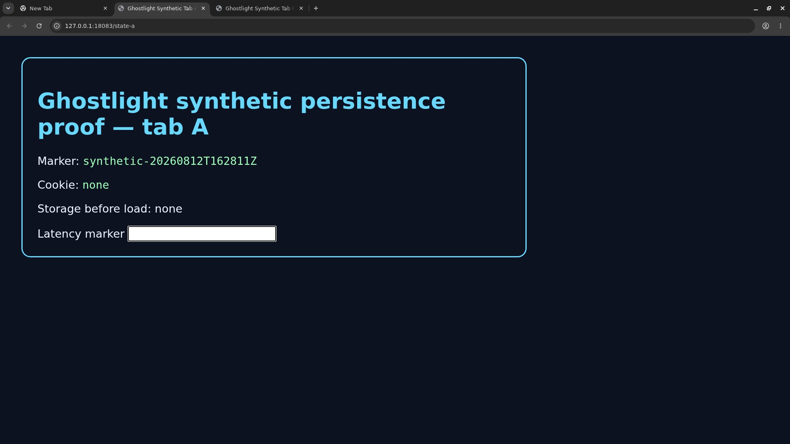
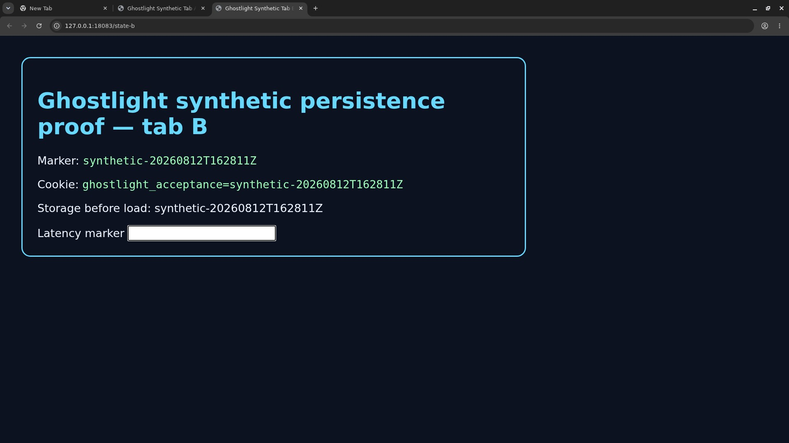
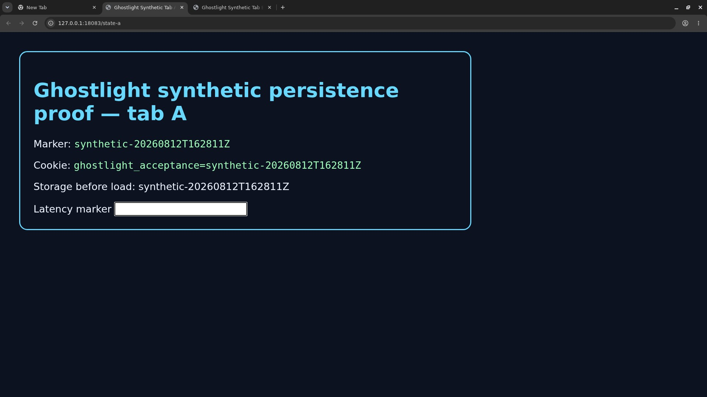

# Improvement acceptance status

Date: 2026-08-12

## Reproducible lanes

`tests/acceptance/run-linux-persistence.sh` creates an isolated Compose project,
uses a fresh mode-0700 Chromium profile, serves two privacy-safe loopback pages,
sets cookie and local-storage markers, recreates both containers, and requires
the two tabs and markers to return. Test-only CDP is bound to host loopback.
Screenshots are audited for metadata and configured credential/address markers
in encoded bytes and required Tesseract OCR output.

`tools/test-macos-relaunch.sh` packages no behavior of its own: it launches the
provided Ghostlight app with a control URL, requires the macOS Accessibility
tree to report `Viewer loaded`, quits, relaunches with
`GHOSTLIGHT_CONTROL_URL` explicitly removed, requires the same semantic state,
and captures audited screenshots.

`tools/collect-performance.sh` samples WebRTC stats and container CPU/memory.
Its 2026-08-12 VP8 result is committed under `docs/performance`.

## Executed status

- **Linux persistence: passed.** Source `f94bb784316e206674234407a75170b10dd0e7bc`
  built and started with healthy viewer and control services. Compose then
  removed and recreated both containers with new IDs. Chromium restored both
  synthetic tabs, and the new server requests carried the saved cookie and
  local-storage marker for tabs A and B. The transcript, target lists, request
  logs, hashes, and four screenshots are in `linux-persistence/`.
- **macOS relaunch: passed through Computer Use.** The first scripted attempt
  did not receive the required Accessibility response and remains recorded in
  `macos-relaunch/transcript.txt`. A later interactive run reached `Viewer
  loaded`, exited the packaged app through Cmd-Q, and relaunched the exact
  bundle without an environment override from the saved loopback control URL
  without another Connect action. The packaged binary hashes
  to `26581f3d480584a3216f9494835f6fcade02054fe5cfe3de877d5e49c3f27fcf`;
  the [native receipt and screenshots](../2026-08-12/README.md#native-macos-navigation-receipt)
  record that WebKit-navigation result.
- **Performance: measured.** The VP8 working-tree measurement observed live
  inbound media, 251 decoded frames, zero dropped frames, bitrate, a dispatch-to-next-presented-frame phase,
  CPU, and memory. Its transcript does not record an exact commit SHA.

These lanes do not exercise Gmail or make any claim about seven-day daily-driver
acceptance. Synthetic pages are deliberate so receipts contain no account data.

## Linux screenshots

Before recreation:

After recreation:

