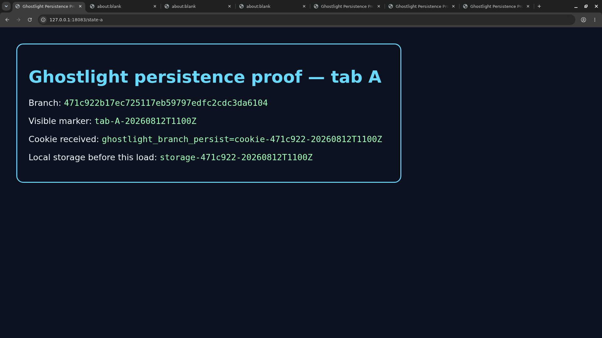
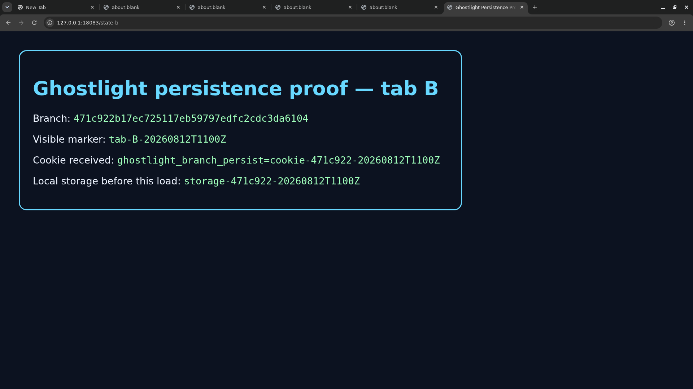
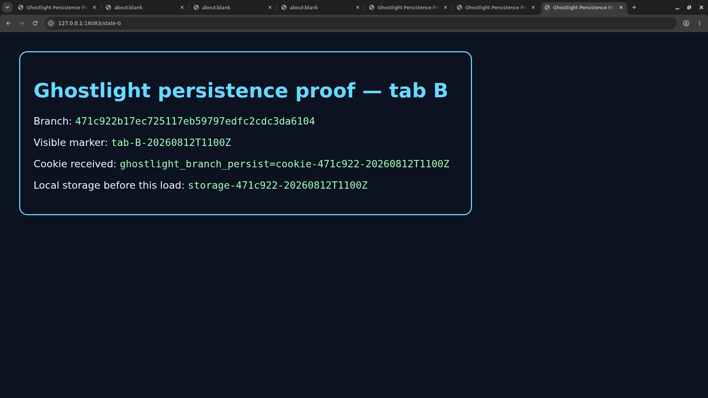

# Day-one browser persistence receipt

Date: 2026-08-12

Test checkout: `a4454a329de191d113d6d447809ba4b89121819e`

Runtime implementation under test: `471c922b17ec725117eb59797edfc2cdc3da6104`. The later test checkout changed README files only.

This receipt tests Ghostlight's Linux persistence boundary with synthetic pages. The screenshots show synthetic loopback pages and blank tabs. They contain no account data, credentials, non-synthetic hostnames, or routable IP addresses.

## Result

Two rendered Chromium tabs, their cookie, and their local-storage value survived `docker compose down` followed by `docker compose up`. Both the viewer and control containers were replaced:

| Service | Before | After |
| --- | --- | --- |
| Viewer | `f59ea1a1acaa93696ba66cfc7fe28b00517acc5e085bea0840c3c308461a23f2` | `175de06fb0cf9b8f1519080c929cc8eeccd6af9d9afcc830bf7cf88e209e89ea` |
| Control | `bea76daec4d233effb742087f7654ceaa437c6079223b1ac49ed0d9a0753fc6e` | `721814f0070d07416db512bf9ab29be4221db21eb21f4341842f68b993cf9347` |

After recreation, both services reported healthy. Chromium's restored-target list contained `state-a` and `state-b`, and the page server received the restored requests with `ghostlight_branch_persist=cookie-471c922-20260812T1100Z`. The screenshots also show the same local-storage marker before and after recreation. The [captured transcript](transcript.txt) records the commands, test hooks, health states, target list, request lines, container IDs, and image hashes.

## Screenshots

Before recreation, tab A:

Before recreation, tab B:

After recreation, tab A:

After recreation, tab B:

## Scope

This is a day-one Linux browser-level receipt. The nested test host required a test-only AppArmor override, and its installed Buildx version required `COMPOSE_BAKE=false`. Test instrumentation also enabled Chromium's debugging protocol and mounted a loopback proxy and synthetic page server. None of these hooks is part of Ghostlight's committed runtime. The PNGs are X-display captures of Linux Chromium; they are not Ghostlight.app, WKWebView, or WebRTC screenshots.

This receipt does not claim that Gmail, the native macOS relaunch flow, or the seven-consecutive-day acceptance gate has passed. Those remain separate acceptance checks.

## Native macOS navigation receipt

The [native macOS receipt](native-macos-receipt.json) binds the packaged app to macOS source commit `af26a8b47f4598038b06604aab34134ebccaf674` and binary SHA-256 `26581f3d480584a3216f9494835f6fcade02054fe5cfe3de877d5e49c3f27fcf`. The app discovered a synthetic loopback viewer, reached `Viewer loaded` through `WKWebView`, exited through Cmd-Q, and relaunched without an environment override from the saved control URL without another Connect action. The [initial screenshot](native-viewer-loaded.png) and [relaunch screenshot](native-relaunch.png) were inspected for privacy and contain only synthetic loopback content. The [transcript and checksum manifest](native-macos-sha256sums.txt) are committed alongside them.

This native receipt does not claim Neko authentication, WebRTC media, or Gmail persistence. Those remain separate checks.
