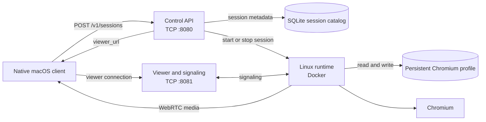

# Ghostlight alpha architecture

This document defines the alpha deployment shape and the interfaces shared by the control service, Linux runtime, viewer, and native macOS client.

The alpha supports one user, one browser session, direct LAN connectivity, and a Docker-based Linux runtime.

## Data flow

1. The macOS client sends `POST /v1/sessions` to the control service on TCP port `8080`.
2. The control service creates a session identifier, writes the session record, and starts the Linux runtime for that identifier.
3. The runtime starts Chromium with the session's persistent profile directory.
4. The control service returns the session identifier, a `viewer_url`, and the UTC creation time to the macOS client.
5. The macOS client connects to the viewer on TCP port `8081` and uses the viewer for connection setup.
6. The runtime and client complete WebRTC negotiation. Browser media travels from the runtime to the client after negotiation; the control service does not carry browser media.

## Components

| Component | Alpha responsibility | Durable state owned by the component |
| --- | --- | --- |
| macOS client | Create a session, open the viewer URL, and render the browser stream. | Client preferences selected by the implementation. |
| Control service | Expose the session API, allocate the runtime, persist session metadata, and return viewer URLs. | The session catalog. |
| Linux runtime | Run Chromium, expose the viewer/signaling endpoint, and publish the WebRTC stream. | The browser profile volume. |
| Viewer | Serve the viewer connection and carry signaling messages required to establish the stream. | No required durable state. |

The control service is the lifecycle coordinator. The runtime owns browser-process state. The viewer owns connection setup. A component must not write another component's durable store directly.

## Trust boundaries

The following boundaries are part of the alpha design. Implementation work must enforce the controls listed in the final column.

| Boundary | Data crossing the boundary | Alpha trust assumption and required control |
| --- | --- | --- |
| macOS client to LAN services | Session requests, session metadata, viewer URL, and signaling traffic | The LAN can contain other hosts. Bind services to the intended private interface, avoid automatic port forwarding, and treat the viewer URL as a bearer capability. |
| Control service to runtime container | Session lifecycle commands and runtime identifiers | The control service may start and stop the local container. Limit container mounts to the assigned profile and required runtime data. |
| Chromium to web content | URLs, cookies, local storage, downloads, and page scripts | Web content is untrusted. Keep Chromium inside the runtime container and avoid host mounts beyond the profile and explicitly required data. |
| Runtime to persistent storage | Chromium profile files and runtime data | The local operator controls the host filesystem. Restrict permissions on profile data and exclude it from source control and diagnostic uploads. |
| LAN services to external sites | Browser requests initiated by Chromium | A visited site can be malicious. The alpha relies on Chromium and container isolation for this boundary and does not promise host-kernel isolation. |

## LAN threat model

### Attacker capabilities

The alpha assumes an attacker can send packets to the host's LAN addresses and can observe traffic on the local network. The attacker may:

- call the control endpoint and consume a session slot or runtime resources;
- capture an unencrypted HTTP request or response when the deployment does not add TLS;
- read a `viewer_url` from captured traffic, logs, or a shared screen;
- send malformed requests to the control or viewer ports;
- supply or navigate Chromium to hostile web content; and
- attempt denial of service against the host or runtime.

### Protected assets

- Chromium cookies, local storage, downloaded files, and active website sessions;
- the session catalog and its lifecycle records;
- the host filesystem outside the runtime's assigned data paths; and
- the availability of the single alpha session.

### Alpha controls

- Generate session identifiers with a cryptographically secure random source and keep them opaque.
- Treat `viewer_url` as a bearer capability. Do not use it as proof of user identity.
- Bind the control and viewer services to the intended LAN interface. Do not enable UPnP or automatic internet port forwarding.
- Keep control requests, viewer URLs, cookies, and profile paths out of routine logs.
- Apply a one-session limit until multi-session lifecycle and cleanup are implemented.
- Use the WebRTC transport's authenticated encryption for media when the selected implementation supports it. The control and viewer HTTP paths remain cleartext unless the deployment adds TLS.
- Treat a container escape or host compromise as outside this boundary. Docker isolation provides containment for the alpha; host security requires separate controls.

An operator must keep the service on a private LAN. Public internet exposure, authentication, and TLS require a separate design and acceptance review.

## Persistence model

| Data | Planned location | Lifecycle | Sensitivity |
| --- | --- | --- | --- |
| Session record | `control/ghostlight.db` SQLite file | Created by `POST /v1/sessions`; updated as the session starts or stops; removed by explicit cleanup. | Contains identifiers, timestamps, status, runtime references, and viewer URLs. |
| Chromium profile | `runtime/data/<session-id>/profile` on a host volume | Created with the session; retained across runtime restarts; removed by explicit session cleanup. | May contain cookies, local storage, history, downloads, and website credentials. |
| Runtime container | Docker-managed container state | Created when the session starts; removed when the session stops. | Contains active browser process state. |
| WebRTC negotiation | In-memory runtime and viewer state | Exists only during connection setup and the active stream. | May contain network candidates and connection metadata. |
| Logs | Process output and deployment-selected log storage | Retention is deployment-controlled. | Must exclude cookies, viewer URLs, and request bodies unless a diagnostic policy explicitly permits them. |

The alpha does not synchronize profiles between hosts. A profile copy or backup must preserve its filesystem permissions and the operator's retention policy.

## Shared API and port contract

| Surface | Port | Contract |
| --- | ---: | --- |
| Control service | `8080/tcp` | Session lifecycle API. |
| Viewer | `8081/tcp` | Viewer connection and WebRTC signaling endpoint. |

### Create a session

`POST /v1/sessions` creates the alpha session and returns HTTP `201 Created` with `application/json`.

The response contains these fields:

| Field | Type | Meaning |
| --- | --- | --- |
| `id` | string | Opaque session identifier. |
| `viewer_url` | string | LAN URL for the viewer on port `8081`. |
| `created_at` | string | UTC timestamp encoded as RFC 3339. |

The alpha request has no required JSON fields. A successful response must include all three fields. The `viewer_url` must resolve to the viewer service selected for the session.

Changes to a field name, field type, port, or path require coordinated updates to the control service, viewer, macOS client, tests, and this document.

## Explicit non-goals

The alpha does not include:

- public internet deployment or automatic port forwarding;
- user authentication, authorization, or TLS termination;
- more than one user or more than one active browser session;
- profile synchronization between machines;
- high availability, failover, or distributed scheduling;
- an enterprise browser policy, compliance report, or audit service;
- host-kernel isolation guarantees beyond the selected container and browser controls;
- browser recording, replay, or media storage; or
- automatic third-party license inventory generation.
