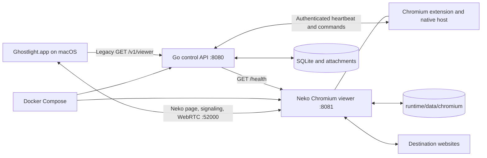

# Ghostlight shipped architecture

This document describes the topology shipped on `2026-08-12`. Ghostlight supports one fixed Chromium profile on one Linux host and one native macOS client on a trusted private network.

## Topology

Docker Compose starts one Neko Chromium container and one Go control container. Control persists one workspace and browser session, exclusive controller leases, stream descriptors, browser commands, tab snapshots, and attachment metadata. A Manifest V3 extension observes Chromium tabs and applies a bounded command set through a native-messaging host. The current macOS client still requests the configured viewer URL and loads the Neko web client in `WKWebView`; migration to the session API is a later slice. Neko continues to own viewer authentication, signaling, media transport, and input transport. Control carries no website traffic, viewer credentials, signaling, media, or input.

## Connection sequence

1. The operator starts the Compose project from the repository root.
2. Compose starts Neko and waits for a successful response from its `/health` endpoint.
3. Compose starts control after Neko becomes healthy.
4. Control opens its SQLite catalog and checks storage plus viewer health before reporting readiness.
5. The extension connects to the native host, authenticates with `GHOSTLIGHT_BRIDGE_TOKEN`, bootstraps the durable session, and reports the authoritative tab snapshot.
6. An API client authenticates with `GHOSTLIGHT_API_TOKEN`, acquires the exclusive controller lease, and submits revision-fenced commands with the returned lease token.
7. The bridge polls, applies each bounded Chromium command, acknowledges it, and publishes a new tab snapshot.
8. The current macOS client sends legacy `GET /v1/viewer`; `WKWebView` loads the Neko page and negotiates WebRTC after Neko authentication.

The macOS `Viewer loaded` state occurs after step 6 when WebKit reports navigation completion. It is not evidence that steps 7 and 8 completed.

## State ownership

| State | Owner | Location | Lifetime |
| --- | --- | --- | --- |
| Control URL | macOS client | `UserDefaults` | Saved after discovery; removed by **Disconnect**. |
| Runtime configuration and Neko passwords | Linux operator | `runtime/.env` | Persists until the operator changes or removes the file. |
| Viewer URL | Control process | `GHOSTLIGHT_VIEWER_URL` environment value | Recreated with the control container. |
| Workspace, session, revision, lease epochs, commands, streams, tab snapshots, and attachment metadata | Control service | `ghostlight-control-state` SQLite volume | Persists across control-container recreation. |
| Attachment bodies | Control service and native host | `ghostlight-control-attachments` volume, staged into the viewer downloads volume | Persists until the named volume or file is removed. |
| Chromium browser data | Chromium through Neko | `runtime/data/chromium` bind mount | Persists across container recreation and `docker compose down`. |
| Neko login and WebRTC connection state | Neko process and embedded client | Process memory | Ends when the viewer or client connection ends. |
| Container lifecycle state | Docker Compose and Docker Engine | Docker-managed state | Recreated by Compose operations. |

The catalog models the one browser runtime that Compose owns; it does not create or destroy containers. Lease tokens are stored only as hashes, commands are idempotent and revision-fenced, and an expired lease cannot mutate the session. Legacy viewer discovery remains stateless and returns the same configured viewer URL to every caller that can reach it.

## Runtime lifecycle

Compose owns the two service lifecycles:

- `docker compose up -d` creates or starts the viewer and control services.
- `restart: unless-stopped` applies to both containers.
- Control has `depends_on: viewer: condition: service_healthy`.
- `docker compose down` removes the containers and Compose network while leaving the host profile directory.
- The backup script stops the viewer before archiving the profile and leaves it stopped for operator inspection.

No control API route starts, stops, recreates, or deletes either container.

## Health contracts

| Surface | Meaning | Excluded evidence |
| --- | --- | --- |
| Control `GET /healthz` | The Go handler answered. | Viewer health, storage, Chromium state, WebRTC, and website state. |
| Neko `GET /health` | Neko returned an HTTP success response. | macOS reachability, Neko login, WebRTC negotiation, and restored website state. |
| Control `GET /readyz` | Control reached Neko `/health`, received `2xx` within two seconds, and pinged its SQLite store. | macOS reachability, Neko login, WebRTC media, and website state. |
| Runtime smoke script | Control liveness, direct Neko health, storage-aware readiness, legacy discovery, authenticated workspace discovery, bridge bootstrap, and discovered viewer health succeeded. | Native app launch, Neko login, WebRTC media, and Gmail persistence. |

Preflight establishes the storage condition that health endpoints omit. It requires profile mode `700`, rejects a symlink profile path, and uses the pinned Neko image as uid `1000` to create and remove a marker in that directory.

## Storage and backup

The viewer bind-mounts the default host path `runtime/data/chromium` at `/home/neko/.config/chromium`. The managed Chromium policy allows cookies and requests previous-session restoration. Cookies, local storage, browsing and download history, tabs, and site sessions belong to this profile. Downloads use `ghostlight-downloads`; control state and attachment bodies use separate named volumes. State directories are mode `700`; the database, SQLite sidecars, and staged files are mode `600`.

The Chromium profile remains the authoritative website-state store. The control database indexes product state and the latest browser snapshot, not cookies or page contents. Removing the profile makes its prior website state unavailable; removing the control-state volume removes the product catalog and lease epochs.

`runtime/bin/profile-backup.sh backup` rejects links and special files in the profile, stops the viewer, and atomically publishes a mode-`600` gzip-compressed tar archive plus SHA-256 sidecar. It leaves the viewer stopped. Restore accepts one archive root containing unique relative regular-file and directory entries. It verifies the checksum, rejects unsafe paths and entry types, extracts through a temporary directory, and renames the result to a new absolute mode-`700` destination. Restore does not overwrite the active profile or change the Compose mount.

## Network boundaries

| Boundary | Data | Shipped control | Remaining exposure |
| --- | --- | --- | --- |
| Mac to control `8080/tcp` | Legacy discovery plus workspace, session, lease, command, stream, and attachment requests | Product routes require the API bearer token; lease writes also require a short-lived lease token. Ports bind to `GHOSTLIGHT_BIND_ADDRESS`. | Health, readiness, and legacy discovery remain unauthenticated. The API has no TLS or rate limit. |
| Viewer bridge to control | Bootstrap, tab snapshots, command polling, acknowledgements, and attachment fetches | A separate bridge bearer token authenticates these routes. The extension ID and command enum are fixed. | A compromised viewer container can use its bridge token and alter browser product state. |
| Mac to Neko `8081/tcp` | Login page, credentials, and signaling | Neko requires the configured user or admin password. | The default viewer URL uses HTTP; the repository supplies no TLS termination. |
| Mac to Neko `52000/udp,tcp` | Browser media and input | Both mux protocols bind to the selected host address. | Host firewall and NAT configuration determine reachability. The repository supplies no TURN service. |
| Chromium to websites | Page requests, scripts, cookies, and downloads | Chromium runs in the Neko container with a managed policy and one profile mount. | Website content remains untrusted and can alter browser state within Chromium's permissions. |
| Viewer to host profile | Browser files | Preflight requires mode `700`, rejects a symlink path, and checks uid-`1000` write access. | A compromised viewer can read and change the mounted profile. |
| Operator to backups | Archived profile and checksum | Backup and restore reject operator-controlled symlink path components; restore also rejects traversal, links, special files, duplicate entries, and existing destinations. | Archive contents include active website credentials and require operator-controlled storage. |

`GHOSTLIGHT_BIND_ADDRESS`, `GHOSTLIGHT_VIEWER_URL`, `GHOSTLIGHT_VIEWER_HEALTH_URL`, and `NEKO_WEBRTC_NAT1TO1` are separate settings. Preflight requires the client-facing viewer URL host and advertised NAT address to match and limits the bind value to literal private, link-local, and loopback ranges. Neko listens on its private Compose network, while Docker publishes its ports only on `GHOSTLIGHT_BIND_ADDRESS`. Compose defaults the health target to the internal `viewer:8080` service name so readiness does not confuse a container-local loopback address with the client-facing viewer address. The runtime does not confirm local interface assignment, configure a firewall, enable TLS, or configure NAT.

## Image selection

The viewer image is selected by a digest-pinned `NEKO_IMAGE` value mirrored in the environment example, Compose fallback, and runtime test. The live persistence harness reads that value from the environment example. The committed value names the public `ghcr.io/evalops/ghostlight-viewer` multi-architecture index. Its Dockerfile starts from the exact upstream Neko Chromium 3.1.5 digest, verifies source commit `395ca1a6f62b7b0e270e654d366a2d57b8042efd` and its tarball hash, rebuilds the Neko server with four patched Go module versions, and installs six fixed Debian packages from the `20260812T000000Z` snapshot. The control image is built locally from digest-pinned Go and Alpine base images. Repository checks restrict viewer pins to the upstream and owned namespaces, reject inconsistent pins and a hardcoded acceptance-harness digest, and reject mutable Docker bases or GitHub Actions without full commit SHAs. An experimental opt-in Compose override (`runtime/docker-compose.gpu.yml`) passes a host Intel GPU to the viewer and switches Chromium to VA-API flags, leaving the default software path unchanged; see [GPU acceleration](gpu-acceleration.md).

Protected run `31621725290` found 32 fixed `HIGH` vulnerabilities in the upstream Neko 3.1.5 image: 18 in Debian packages and 14 in `/usr/bin/neko`. That image cannot pass the repository's fixed-vulnerability gate. The owned image build publishes `linux/amd64` and `linux/arm64` variants with SBOM and provenance attestations; publish run [`31632547870`](https://github.com/evalops/ghostlight/actions/runs/31632547870) produced the public index now pinned by the runtime. The [main viewer security receipt](security/2026-08-12-viewer-main/README.md) records the build pipeline's platform, scanner, provenance, and health evidence. The release candidate workflow repeats the live persistence and fixed-vulnerability checks against the promoted digest before merge.

The weekly or manually dispatched browser-update workflow resolves upstream Neko candidate tags to immutable digests in a read-scoped job. It updates only `viewer/Dockerfile` and `control/Dockerfile`, rebuilds the hardened viewer from the resolved upstream base, builds control, runs runtime and backup checks, recreates the live synthetic Linux persistence stack with the hardened candidate, and scans the viewer plus control for fixed `HIGH` and `CRITICAL` findings. Receipt artifacts are retained for 30 days. A separate write-scoped job opens a unique update pull request only after the candidate job succeeds. Required review, protected checks, and merge remain outside the automation.

Changing a committed digest affects the browser or control runtime after the next image pull, build, or container recreation. The repository performs no unattended merge or host rollout.

## Acceptance boundary

The dated Linux receipt uses synthetic loopback pages and test-only Chromium instrumentation to show profile persistence through one Compose recreation. The live Linux harness adds loopback CDP plus a synthetic page server through a temporary Compose override, then checks tab, cookie, and local-storage restoration after both containers receive new IDs. These fixtures are absent from the shipped runtime Compose model.

The macOS relaunch tool launches the packaged app with a synthetic control URL, waits for `Viewer loaded` through Accessibility, captures a screenshot, quits, and relaunches without the environment URL. Reaching `Viewer loaded` again exercises saved-URL discovery and WebKit navigation. It does not inspect authenticated Neko state or decoded media frames.

The streaming tool authenticates to a running Neko viewer and records WebRTC statistics for the negotiated stream, a dispatch-to-next-presented-frame phase, container statistics, and Neko pipeline logs. The harness does not prove that the input caused the next frame, so this phase is not an input-latency measurement. A requested H.264 preference is measurement-only and does not change the runtime configuration. The repository keeps the pinned default pending paired codec receipts and a native WKWebView decoding receipt.

On `2026-08-12`, the Linux persistence lane at source `f94bb784316e206674234407a75170b10dd0e7bc` built the stack, required healthy viewer and control services, recreated both containers, and restored two synthetic tabs with their cookie and local-storage marker. Its test-only override shares the viewer network namespace with control because the nested host filters sibling-container bridge traffic. A Computer Use run against the packaged app from macOS source commit `af26a8b47f4598038b06604aab34134ebccaf674` reached `Viewer loaded`, exited through Cmd-Q, and relaunched the exact bundle without an environment override from the saved control URL without another Connect action; this proves WebKit navigation, not authenticated Neko or decoded WebRTC media. The working-tree VP8 measurement captured 251 decoded frames, zero dropped frames, 1.17 Mbps received bitrate, a 72.43 ms dispatch-to-next-presented-frame phase, viewer CPU samples from 3.62% to 96.01%, and viewer memory samples from 272.4 MiB to 376 MiB. The next frame was not proven to have been caused by the input, so 72.43 ms is not input latency.

The backup shell tests use synthetic cookie, tab, and local-storage fixtures. None of these checks establishes Gmail persistence or sleep/wake recovery.

## Explicit non-goals

The shipped alpha has no multi-user scheduler, public-internet deployment, TLS termination, user identity system, TURN service, profile synchronization, browser recording, automatic browser update, or host-failover path. The current macOS release does not yet consume the new session resources. Releases are ad-hoc signed unless the Apple signing secrets described in the README are configured.

Compose remains the lifecycle owner until a reviewed Dex design, migration, and acceptance receipt replace this architecture.
