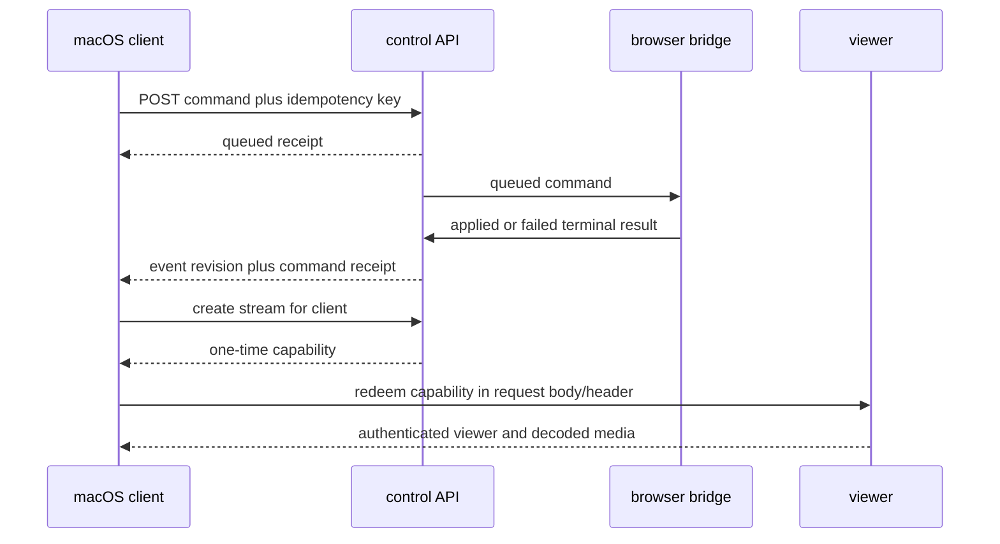

# Ghostlight Native Daily Driver - Plan

## Goal Capsule

Turn the current native session shell into a recoverable daily browser surface. Every user command must have a durable terminal receipt, viewer setup must disappear behind a scoped one-time handoff, Home must retain workspace choices, recovery must be bounded and testable, and performance claims must remain causal and fail closed.

## Product Contract

### Problem Frame

The native client can drive remote Chromium, but command completion, viewer authentication, workspace personalization, recovery behavior, and interaction-quality gates are not yet one coherent user contract.

### Requirements

**Commands and native behavior**

- R1. A browser command has one stable identifier and the durable states `queued`, `applied`, or `failed`.
- R2. A terminal receipt records expected revision, resulting revision, creation time, completion time, stable error code, and bounded result data.
- R3. Replaying the same idempotency key and payload returns the original receipt; reusing the key with another payload fails.
- R4. The Mac app shows pending and failed command state and supports Cmd-L, Cmd-T, Cmd-W, Cmd-R, and tab cycling.

**Viewer capability handoff**

- R5. Stream creation returns a random, session-scoped, client-scoped, single-use viewer capability with a maximum 60-second lifetime.
- R6. The capability is redeemed in an HTTP header or message body, is never placed in the viewer URL, and only a hash is stored.
- R7. The native app loads the redeemed viewer directly and hides setup controls after the first decoded frame.

**Workspace Home**

- R8. Home shortcuts persist by workspace and support add, rename, remove, and deterministic ordering.
- R9. Recent destinations persist by workspace with a bounded size and no credential-bearing URLs.
- R10. Each workspace owns its search provider, with the current Google behavior as the default.

**Recovery and performance**

- R11. Automated bounded scenarios cover network loss, viewer restart, Chromium restart, control restart, lease expiry/controller transfer, and a deterministic suspension surrogate; no calendar-duration gate is permitted.
- R12. Every recovery scenario has a fixed cycle count, per-cycle timeout, terminal receipt, and cleanup receipt.
- R13. Performance comparison requires source SHA equal to HEAD, four timestamped phases, process attribution, negotiated codec, selected UDP candidate pair, client WebRTC statistics, causal pixel markers from X11-equivalent input, and dropped-frame evidence.
- R14. CDP is optional provenance only and cannot decide whether a run is valid.
- R15. A candidate passes only when CPU improvement exceeds observed noise and paired latency and quality gates do not regress.

### Key Decisions

- Token handoff precedes direct signaling. (session-settled: user-directed — chosen over direct signaling first: remove visible setup without expanding the transport architecture.) Governs R5-R7.
- Recovery uses bounded cycles, not elapsed calendar time. (session-settled: user-directed — deterministic failures are faster and produce attributable receipts.) Governs R11-R12.
- Performance input uses X11-equivalent actions and treats CDP as optional. (session-settled: user-directed — chosen over CDP-driven input: the measured path must match real viewer input.) Governs R13-R15.

## Planning Contract

### Key Technical Decisions

- KTD1. Keep `Idempotency-Key` as Ghostlight's documented API contract. The active IETF document expired in April 2026, so the implementation must not claim RFC status. R1-R3 own behavior.
- KTD2. Complete commands in the existing SQLite transaction that advances session revision. Store terminal timestamps and error codes as first-class columns; keep human detail optional and bounded.
- KTD3. Generate capability secrets with `crypto/rand`, store SHA-256 hashes, bind redemption to session and client, atomically mark redeemed, and reject expiry or replay. This applies the replay and audience constraints from RFC 6750, RFC 9449, and RFC 9700 without adding OAuth machinery.
- KTD4. Persist workspace Home data in control SQLite rather than `UserDefaults`, because the workspace is the ownership boundary shared by clients.
- KTD5. Recovery tests use explicit asynchronous deadlines and fixed cycles. A cycle passes only after authoritative session state, controller ownership, decoded video, and one accepted input command recover.
- KTD6. Performance deltas use cumulative W3C WebRTC counters over phase windows. A receipt must include `framesDecoded`, `framesDropped`, `totalDecodeTime`, `jitterBufferDelay`, `jitterBufferEmittedCount`, freeze counters, codec, and the selected candidate pair.

### High-Level Technical Design

## Implementation Units

### U1. Durable terminal command receipts

- **Requirements:** R1-R3.
- **Files:** `control/models.go`, `control/store.go`, `control/product_api.go`, `control/product_test.go`, `viewer/extension/command-completion.js`, `viewer/extension/test/command-completion.test.mjs`.
- **Approach:** Migrate command storage, normalize terminal states, expose resulting revision and stable error code, retain same-payload replay, and add terminal receipts to the event response.
- **Test scenarios:** applied replay, failed replay, payload conflict, bridge acknowledgment replay, stale lease, bounded result, and migration from schema version 1.

### U2. Native pending/error UX and browser ergonomics

- **Requirements:** R4.
- **Files:** `macos/Sources/GhostlightApp/SessionModels.swift`, `macos/Sources/GhostlightApp/SessionClient.swift`, `macos/Sources/GhostlightApp/SessionViewModel.swift`, `macos/Sources/GhostlightApp/GhostlightApp.swift`, `macos/Tests/GhostlightAppTests/NativeSessionTests.swift`.
- **Approach:** Track submitted command receipts until terminal state, render one compact status surface, and route standard menu commands to the existing revision-fenced methods.
- **Test scenarios:** queued-to-applied, queued-to-failed, retry returns same command, each shortcut routes once, and disabled observer actions do not submit.

### U3. One-time viewer capability

- **Requirements:** R5-R7.
- **Files:** `control/models.go`, `control/store.go`, `control/product_api.go`, `control/product_test.go`, `viewer/bridge/main.go`, `viewer/bridge/main_test.go`, `macos/Sources/GhostlightApp/SessionClient.swift`, `macos/Sources/GhostlightApp/ViewerWebView.swift`.
- **Approach:** Mint and atomically redeem a hashed capability before loading the viewer. Preserve the clean URL and use a bootstrap request body or header that does not enter history or logs.
- **Test scenarios:** valid redemption, expiry, wrong session/client, second redemption, plaintext absence from storage/log fixtures, and media-ready UI transition.

### U4. Workspace Home persistence

- **Requirements:** R8-R10.
- **Files:** `control/models.go`, `control/store.go`, `control/product_api.go`, `control/product_test.go`, `macos/Sources/GhostlightApp/SessionModels.swift`, `macos/Sources/GhostlightApp/SessionClient.swift`, `macos/Sources/GhostlightApp/SessionViewModel.swift`, `macos/Sources/GhostlightApp/GhostlightApp.swift`, `macos/Tests/GhostlightAppTests/NativeSessionTests.swift`.
- **Approach:** Add workspace preferences with strict URL validation, ordered shortcut CRUD, bounded recents, and a search template. Seed the current six shortcuts only for a workspace with no preferences.
- **Test scenarios:** seed, reorder, rename, remove, cross-workspace isolation, recent deduplication and cap, unsafe URL rejection, and search-template substitution.

### U5. Bounded recovery harness

- **Requirements:** R11-R12.
- **Files:** `tests/acceptance/recovery.mjs`, `tools/run-recovery-matrix.sh`, `tools/evaluate-recovery.mjs`, `performance/README.md`, `docs/architecture.md`.
- **Approach:** Run five cycles per scenario with a 15-second recovery deadline and mandatory cleanup. Use deterministic process/network interruption hooks and record before, disruption, recovery, and cleanup timestamps.
- **Test scenarios:** all six disruptions, timeout, malformed receipt, source mismatch, cleanup failure, and controller duplication.

### U6. Causal direct-LAN performance gates

- **Requirements:** R13-R15.
- **Files:** `tools/measure-streaming-performance.sh`, `tools/measure-streaming-performance.mjs`, `tools/evaluate-native-performance.mjs`, `tools/evaluate-codec-pair.mjs`, their test files, and `performance/README.md`.
- **Approach:** Make X11 input receipts mandatory, expand W3C statistics, require selected UDP, estimate baseline noise from paired controls, and reject candidates unless CPU wins beyond noise while latency and dropped-frame thresholds hold.
- **Test scenarios:** exact HEAD, missing X11 marker, TCP selection, codec mismatch, absent counters, noisy CPU non-win, latency regression, dropped-frame regression, and valid candidate.

## Verification Contract

| Surface | Verification | Done signal |
|---|---|---|
| Control | `cd control && go test ./...` | All API, migration, replay, capability, and workspace tests pass. |
| Viewer | `cd viewer/extension && npm test` and `cd viewer/bridge && go test ./...` | Command and capability contracts pass. |
| macOS | `cd macos && swift test` and `./macos/package-app.sh` | Native tests and packaged app pass. |
| Recovery | Fixture unit tests plus bounded five-cycle matrix on the isolated runtime | Every cycle and cleanup receipt is measured. |
| Performance | Direct-LAN control and candidate receipts from exact HEAD | Selected UDP, four phases, X11 marker, complete W3C counters, and fail-closed comparison pass. |
| Repository | `./scripts/check-shell.sh`, `./scripts/check-repo-hygiene.sh`, `git diff --check` | CI-equivalent local checks pass. |

## Definition of Done

- U1-U6 are merged through protected PRs without history rewriting or protection bypass.
- Every PR has exact-head tests, review-thread status, required-check status, and merge SHA.
- Raw recovery and performance receipts identify exact source HEAD and do not contain secrets.
- Failed experiments and temporary network rules are absent or documented with cleanup receipts.

## Sources / Research

- RFC 9110, HTTP Semantics: https://www.rfc-editor.org/rfc/rfc9110.html
- RFC 9457, Problem Details for HTTP APIs: https://www.rfc-editor.org/rfc/rfc9457.html
- RFC 9562, UUIDs: https://www.rfc-editor.org/rfc/rfc9562.html
- RFC 6750, Bearer Token Usage: https://www.rfc-editor.org/rfc/rfc6750.html
- RFC 9449, DPoP replay handling: https://www.rfc-editor.org/rfc/rfc9449.html
- RFC 9700, OAuth 2.0 Security Best Current Practice: https://www.rfc-editor.org/rfc/rfc9700.html
- W3C WebRTC Recommendation: https://www.w3.org/TR/webrtc/
- W3C WebRTC Statistics: https://www.w3.org/TR/webrtc-stats/
- RFC 8445, ICE: https://www.rfc-editor.org/rfc/rfc8445.html
- Apple XCTest asynchronous expectations: https://developer.apple.com/documentation/xctest/asynchronous-tests-and-expectations
